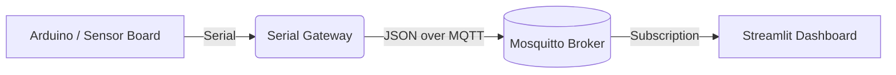

# 🧭 IoT Lab Platform

An educational Internet of Things stack for Datateknikk labs. The project links Arduino hardware to a Python serial gateway, publishes measurements through MQTT, and visualises data inside a Streamlit dashboard. Everything runs locally or in Docker so students can explore embedded sensing, messaging protocols, and data visualisation end-to-end.

## 🔭 System overview



The Streamlit dashboard presents live line charts, recent samples, and CSV export controls so students can explore telemetry in real time.

## 🧰 Hardware prerequisites

- Arduino Uno / Nano / compatible board with USB serial interface
- At least one analog or digital sensor (e.g., potentiometer, temperature sensor)
- USB cable to connect the board to the host running the gateway
- Optional actuators (LED, relay) for command-channel experiments

### Wiring example

1. Connect the sensor output to `A0` (analog) or `D2` (digital)
2. Provide power and ground from the Arduino board
3. Upload the provided example sketch or your custom firmware

## ⚙️ Configuration

Runtime settings are stored in [`config/config.yaml`](config/config.yaml). Key options:

```yaml
serial:
  port: /dev/ttyUSB0
  baudrate: 115200
  reconnect_interval: 5
mqtt:
  host: localhost
  port: 1883
  publish_topic: lab/device1/data
  command_topic: lab/device1/cmd
logging:
  level: INFO
gateway:
  device_id: arduino1
  read_interval: 0.1
dashboard:
  history_size: 200
  csv_output: data/stream.csv
simulation:
  interval: 1.0
  sensors:
    - name: temperature
      min: 20
      max: 30
    - name: humidity
      min: 40
      max: 60
```

Override any value with environment variables (e.g. `IOT_LAB_SERIAL_PORT=/dev/ttyACM0`).

## 🚀 Quick start

### Option 1 – one-command Docker stack

```bash
docker compose up
```

The compose file launches:

- `mqtt-broker`: Eclipse Mosquitto
- `iot_gateway`: Serial/Simulation gateway (reads from serial or generates mock data)
- `iot_dashboard`: Streamlit dashboard at [http://localhost:8501](http://localhost:8501)

Configure the serial device path by editing `config/config.yaml` or setting `IOT_LAB_SERIAL_PORT` in an `.env` file referenced by Docker Compose.

### Option 2 – run locally with Python

1. Create and activate a virtual environment
2. Install dependencies
   ```bash
   pip install -r requirements.txt
   ```
3. Start Mosquitto (Docker or local installation)
4. Run the gateway
   ```bash
   python -m gateway.main
   ```
5. Launch the Streamlit dashboard
   ```bash
   streamlit run dashboard/app.py
   ```

### Simulation mode (no hardware)

Generate mock sensor data:

```bash
python -m gateway.simulation_mode
```

The simulator reuses MQTT topics from the main configuration and produces realistic telemetry for testing.

## 🧪 Example Arduino sketch

```cpp
const int sensorPin = A0;
void setup() {
  Serial.begin(115200);
}

void loop() {
  int sensorValue = analogRead(sensorPin);
  Serial.print("A0:");
  Serial.println(sensorValue);
  delay(1000);
}
```

With the stack running you should see MQTT payloads resembling:

```json
{"device": "arduino1", "sensor": "A0", "value": 452, "timestamp": 1730738800}
```

## 🧱 Architecture details

### Gateway modules

- `serial_reader.py`: resilient serial connection with automatic reconnection
- `message_parser.py`: converts raw serial text to JSON-ready dictionaries
- `mqtt_client.py`: publishes telemetry and listens for optional command topics
- `main.py`: orchestrates the pipeline with logging and graceful shutdown

### Dashboard modules

- `data_handler.py`: subscribes to MQTT, buffers data, and handles CSV export
- `ui_components.py`: reusable Streamlit widgets and charts
- `app.py`: Streamlit entry point integrating controls, charts, and command sender

## ✉️ Message format

Telemetry published to `mqtt.publish_topic` is JSON:

```json
{
  "device": "arduino1",
  "sensor": "A0",
  "value": 452,
  "timestamp": 1730738800
}
```

Additional keys from the Arduino payload (e.g., `units`, `status`) are preserved. Commands to the device are plain UTF-8 strings delivered on `mqtt.command_topic`.

## 🛠️ Extending the system

- Add more sensors by emitting `SENSOR_NAME:VALUE` lines or JSON objects from Arduino
- Scale to multiple devices by giving each gateway a unique `gateway.device_id` and topic namespace (`lab/deviceX/data`)
- Replace the CSV export path with SQLite or InfluxDB integration for persistent logging
- Integrate CNC or other lab equipment by publishing machine telemetry through the same topics

## 🩺 Troubleshooting

| Symptom | Cause | Fix |
| --- | --- | --- |
| `Configuration file not found` | Wrong `IOT_LAB_CONFIG` path | Double-check path or copy the default config |
| Serial port fails to open | Incorrect device path or permissions | Update `serial.port` and ensure the user is in the `dialout` group |
| Dashboard shows no data | MQTT topics mismatch | Confirm publish/subscribe topics align across config and Arduino |
| Mosquitto container exits | Port already in use | Stop other MQTT brokers or change the exposed port |
| MQTT publish errors | Broker offline | Start Mosquitto (`docker compose up`) and ensure network access |

## 🧑‍🏫 Lab workflow

See [lab_instructions.md](lab_instructions.md) for a guided student exercise covering hardware setup, data observation, sensor extension, and dashboard customisation. The document also contains advanced challenge tasks (multi-sensor fusion, anomaly detection, etc.).

## 🤝 Contribution guidelines

1. Fork the repository and create a feature branch
2. Ensure `pytest` passes and add tests for new features
3. Update documentation for user-facing changes
4. Submit a pull request describing the motivation and testing performed

## 🪪 License

Released under the [MIT License](LICENSE). Feel free to remix for teaching, labs, or research projects.

## 🔮 Future roadmap

- Multi-device topic conventions (`lab/<device>/sensor/<type>`)
- Optional time-series database integrations
- Camera metadata streaming for CNC monitoring or computer vision experiments
